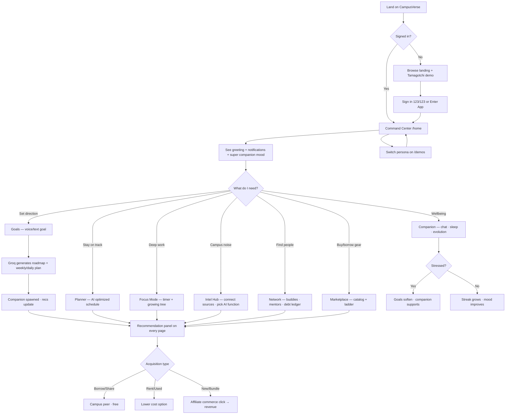
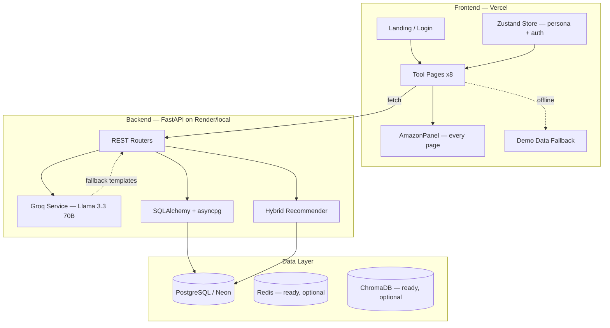

# CampusVerse AI

**The AI Operating System for Student Life**

Built for **Amazon HackON 6.0** — a unified platform that connects goals, wellbeing, campus intelligence, peer networks, and smart product recommendations into one comic-book styled student OS.

| | |
|---|---|
| **Live demo** | [https://frontend-ruddy-one-52.vercel.app](https://frontend-ruddy-one-52.vercel.app) |
| **GitHub** | [cavemansatyn-design/CampusVerse-AI---Amazon-HackON-6.0](https://github.com/cavemansatyn-design/CampusVerse-AI---Amazon-HackON-6.0) |
| **API docs** | `http://localhost:8000/docs` (when backend is running) |

    

---

## Table of Contents

1. [What Is CampusVerse?](#what-is-campusverse)
2. [The Problem We Solve](#the-problem-we-solve)
3. [Platform Features](#platform-features)
4. [Human Flow — How a Student Uses It](#human-flow--how-a-student-uses-it)
5. [Monetization — Affiliate & Commerce Model](#monetization--affiliate--commerce-model)
6. [Architecture](#architecture)
7. [How We Built It](#how-we-built-it)
8. [Tech Stack](#tech-stack)
9. [Recommendation Engine](#recommendation-engine)
10. [AI Layer (Groq)](#ai-layer-groq)
11. [Synthetic Campus Data](#synthetic-campus-data)
12. [Demo vs Live Mode](#demo-vs-live-mode)
13. [API Reference](#api-reference)
14. [Design System](#design-system)
15. [Project Structure](#project-structure)
16. [Setup & Deployment](#setup--deployment)
17. [What's Real vs Mock (Full Transparency)](#whats-real-vs-mock-full-transparency)
18. [Roadmap](#roadmap)
19. [Documentation Index](#documentation-index)
20. [License](#license)

---

## What Is CampusVerse?

CampusVerse AI is **not a dashboard** — it is an **operating system for student life**. Instead of juggling 10 disconnected apps (Notion, Google Calendar, WhatsApp groups, placement portals, Amazon, gym trackers), students get one intelligent layer that:

- Understands **who they are** (persona, goals, budget, hostel status, clubs)
- Watches **campus signals** (email, WhatsApp, notices, deadlines)
- Nudges them with a **Tamagotchi companion** whose mood reflects progress
- Surfaces **contextual product picks** on every screen (buy, bundle, rent, share, or borrow)
- Connects them to **peers, mentors, and shared resources**

Every tool page shares the same **Amazon-style recommendation panel** on the right — ranked by context, persona, and acquisition type.

---

## The Problem We Solve

| Pain | CampusVerse Answer |
|------|-------------------|
| Goals die after week 1 | AI roadmaps + daily/weekly plans + streak tracking |
| Campus noise (100+ emails/notices) | Intelligence Hub: summarize, classify, prioritize, extract deadlines |
| Students overspend on gear | Sustainability ladder: borrow → share → rent → used → new |
| No emotional accountability | Tamagotchi companion with 7 moods, evolution stages, chat |
| Finding study partners is random | Network graph: buddy matching, mentorship, debt ledger |
| Generic shopping recommendations | Goal × club × interest × event × budget hybrid scoring |

---

## Platform Features

### Landing & Auth

| Feature | Description |
|---------|-------------|
| **Landing page** | Comic-book hero, toolkit grid, Tamagotchi mood demo (cycles all 7 emotions in 15s) |
| **Sign in** | Demo login (`123` / `123`) — persisted in browser via Zustand |
| **Persona switching** | 5 demo student profiles on `/demos` — recommendations adapt per persona |

### Command Center (`/home`)

- Personalized greeting and notification feed (deadlines, competitions, peer requests)
- **Super Tamagotchi** — collective mood from all active goals
- **Streak monitor** — daily / weekly / monthly targets with sliders
- Per-goal cards with individual companion faces, progress bars, streak sliders
- Contextual **Smart Picks** panel (goal-aware recommendations)

### Goal Engine (`/goals`)

- Text or **voice input** (Web Speech API — Chrome/Edge)
- Premade goal templates (DSA, gym, CGPA)
- **Groq-powered AI roadmap** — phases, milestones, projects, companion creature
- Weekly + daily plan blocks
- Per-goal Tamagotchi with mood tied to progress
- Bundle recommendations matched to the active goal

### Companion (`/companion`)

- **Tamagotchi face** ported from [Barqawiz/Tamagotchi-main](Tamagotchi-main/Tamagotchi-main/) — blink, brows, mouth, 7 moods
- Evolution track: Egg → Baby → Explorer → Master → Legend
- Sleep score + wellbeing sliders
- **Live Groq chat** when backend is connected; fallback responses in demo mode
- Stress detection adjusts wellbeing and suggests goal softening

### Smart Planner (`/planner`)

- Calendar-style task view
- **AI schedule optimization** via Groq (`/planner/demo/optimize` or per-student)
- Daily plan, weekly plan, focus sessions, wellness/burnout note

### Focus Mode (`/focus`)

- Pomodoro timer (customizable minutes)
- **Focus tree** grows through 5 stages: Seed → Sprout → Growing → Blooming → Full Tree
- Focus-themed product recommendations (headphones, bundles, etc.)

### Intelligence Hub (`/intelligence`)

- Connect **Gmail** & **WhatsApp** (toggle simulation)
- 7 AI functions with custom comic SVG icons:
  - Summarize · Classify · Prioritize · Extract Deadlines · Detect Opportunities · Smart Alerts · Organize Study Material
- Per-function content panels + dynamic recommendation panel title
- Solid white panels for readability on busy comic backgrounds

### Network (`/network`)

- Study buddy matches (shared goals + interests + score)
- Mentorship cards + mock interview matching
- Project team finder
- **Financial debt ledger** (owe / lent / shared buys)
- Shared purchase splits

### Marketplace Engine (`/marketplace`)

- Full catalog browse (1050+ items when backend seeded)
- Acquisition ladder visualization
- Wishlist + rental tracking inputs
- Product images via keyword-based URLs with fallbacks

### Recommendations Panel (every tool page)

- Sticky **AmazonPanel** on the right of every module
- Shows ranked picks with acquisition badge, match %, price, reason
- Ladder: **Buy New → Bundle Deal → Refurbished → Used → Rent → Share → Borrow Free**
- Deduplicated by product name; persona-aware shuffle

### Demos / Personas (`/demos`)

| Persona | Student | Focus |
|---------|---------|-------|
| First-Year Student | Aarav Sharma | DSA, CGPA, study buddies |
| Placement Aspirant | Priya Patel | Internships, mock interviews |
| Hackathon Participant | Rohan Mehta | USB hub, power bank, snacks |
| Hostel Fresher | Sneha Reddy | Dorm essentials, gym transformation |
| Research Enthusiast | Arjun Iyer | ML tools, fellowships, Kindle |

---

## Human Flow — How a Student Uses It



### Example: First-Year Student (Aarav)

1. Opens **Demos** → selects First-Year Student
2. Lands on **Command Center** — sees DSA Dragon at Explorer stage, ML Challenge deadline alert
3. Opens **Goals** → creates "Learn DSA" → Groq returns phased roadmap
4. Right panel shows: Mechanical Keyboard (new), DSA Bundle, Calculator (borrow from senior)
5. Opens **Network** → matched with Vikram (85% — shared DSA goal)
6. Opens **Intel Hub** → Extract Deadlines → sees internship + library dates
7. Clicks a **Buy New** recommendation → affiliate link (monetization path)

### Example: Hackathon Participant (Rohan)

1. Switches to Hackathon persona
2. Recommendations shift to USB Hub, Power Bank, Energy Snacks
3. **Planner** optimizes 48-hour sprint schedule
4. **Focus Mode** runs Pomodoro while focus tree grows
5. **Marketplace** shows hackathon catalog items

---

## Monetization — Affiliate & Commerce Model

CampusVerse is designed to earn through **contextual affiliate commerce** while keeping students' budgets and sustainability in mind.

### How it works

```
Student context (goals + events + persona + budget)
        ↓
Hybrid recommendation engine ranks products
        ↓
AmazonPanel shows ladder: expensive/acquisition-first at top
        ↓
Student clicks "Buy New" or "Bundle Deal" item
        ↓
Redirect through Amazon Associates / affiliate tag URL
        ↓
Commission on qualifying purchases
```

### Acquisition ladder strategy

| Tier | Type | Student benefit | Revenue |
|------|------|-----------------|---------|
| 1 | **Buy New** | Premium gear, fastest path | **Highest affiliate commission** |
| 2 | **Bundle Deal** | Curated kit, perceived savings | **Strong bundle affiliate / partner deals** |
| 3 | Refurbished | Budget premium | Affiliate / marketplace partner |
| 4 | Used | Campus marketplace | Platform fee (future) |
| 5 | Rent | Short-term need | Rental partner commission |
| 6 | Share | Split with roommates | Engagement → future premium |
| 7 | Borrow Free | Senior/hostel/club | Trust + retention (no direct revenue) |

**Design philosophy:** Show sustainable options (borrow/share) for trust and hackathon narrative, but rank **Buy New and Bundle** at the top of the panel where purchase intent is highest — matching the `ACQUISITION_LADDER` sort order in code.

### Current implementation status

| Component | Status |
|-----------|--------|
| Recommendation ranking & panel UI | ✅ Built |
| Product catalog (1050+ items) | ✅ Built (seed script) |
| Context-aware picks per module/persona | ✅ Built |
| Product images | ✅ Built (LoremFlickr + placehold.co fallback) |
| Affiliate redirect URLs (`tag=campusverse-20`) | 🔜 Planned — clicks currently display product cards without outbound affiliate links |
| Amazon Product Advertising API | 🔜 Future — for live prices & ASINs |
| Campus peer-to-peer marketplace transactions | 🔜 Phase 4 |

---

## Architecture



### Service map

```
┌─────────────────────────────────────────────────────────────────┐
│                     RECOMMENDATION SERVICE                       │
│         Goals × Clubs × Interests × Budget × Events              │
│         Output: ranked items + acquisition type + reason         │
└────────────▲────────────────────────────────────────────────────┘
             │ fed by all modules
┌────────────┴────────────────────────────────────────────────────┐
│  Dashboard   │  Goals + Groq    │  Companion + Chat            │
│  Intelligence│  Planner         │  Network                     │
│  Marketplace │  Focus           │  Students / Catalog          │
└─────────────────────────────────────────────────────────────────┘
```

See [docs/ARCHITECTURE.md](docs/ARCHITECTURE.md) for the full system design and [docs/ER_DIAGRAM.md](docs/ER_DIAGRAM.md) for the database schema.

---

## How We Built It

### Phase 1 — Foundation
- FastAPI monolith with async PostgreSQL (Neon-compatible)
- Next.js 16 App Router frontend with comic design system
- Synthetic campus generator: 1000 students, 16 clubs, 1050 catalog items, friendships, mentorships

### Phase 2 — Intelligence
- Groq integration (`llama-3.3-70b-versatile`) for roadmaps, companion chat, planner optimization, announcement analysis
- Hybrid recommender in `backend/app/services/recommender.py` with weighted scoring
- Demo fallback in frontend (`demo-data.ts`) so the app works without backend

### Phase 3 — Experience
- Per-module comic themes (unique background art, hue, accent colors)
- Tamagotchi companion ported from open-source face engine (canvas-based expressions)
- AmazonPanel on every tool page with persona-aware client-side recommendations
- Intel Hub with custom SVG icons and readable solid panels
- Voice goal input, focus tree, evolution stages, debt ledger UI

### Phase 4 — Deploy
- Frontend → **Vercel** ([live demo](https://frontend-ruddy-one-52.vercel.app))
- Backend → **Render** via `render.yaml` (Docker)
- CORS configured for `*.vercel.app`
- Full frontend integrated into main Git repo (removed broken submodule)

---

## Tech Stack

| Layer | Technology | Purpose |
|-------|------------|---------|
| **Frontend** | Next.js 16, React 19, TypeScript | App Router, SSR/static pages |
| **Styling** | Tailwind CSS 4, custom comic CSS | Anton / Hanken Grotesk / Space Mono |
| **Animation** | Framer Motion | Page transitions, chat bubbles |
| **State** | Zustand (persist) | Persona, login, sidebar |
| **Charts** | Recharts | Analytics displays |
| **Backend** | FastAPI 0.115, Uvicorn | REST API |
| **ORM** | SQLAlchemy 2 (async) + asyncpg | PostgreSQL access |
| **Validation** | Pydantic v2 | Request/response schemas |
| **AI** | Groq API — Llama 3.3 70B Versatile | Roadmaps, chat, planner, intel |
| **Database** | PostgreSQL 16 (Docker local / Neon cloud) | Students, goals, catalog, recs |
| **Cache** | Redis | Configured in docker-compose; not required for MVP |
| **Vector DB** | ChromaDB | Listed in architecture docs; not wired yet |
| **Auth** | Clerk (`@clerk/nextjs` installed) | Ready to integrate; demo uses 123/123 |
| **Deploy** | Vercel (frontend) + Render (backend) | See [docs/DEPLOY.md](docs/DEPLOY.md) |
| **Images** | LoremFlickr keywords + placehold.co | Product thumbnails with error cascade |

---

## Recommendation Engine

### Backend scoring (`recommender.py`)

```
score = goal_match      × 0.35
      + club_match      × 0.25
      + interest_match  × 0.20
      + hostel_context  × 0.15
      + budget_factor
      + sustainability_bonus
      + event_boost (hackathon / placement season)
```

Acquisition priority when scoring catalog items:
**Borrow → Rent → Share → Used → Refurbished → New**

### Frontend panel (`recommendation-data.ts`)

- Module-specific pools (focus, intel, network, marketplace, etc.)
- Persona bias mapping (`first_year` → DSA, `placement` → placement, etc.)
- Sorted by acquisition tier (expensive first for affiliate strategy)
- Deduplicated by product name across merged pools
- Persona-specific shuffle so different demo profiles show different picks

---

## AI Layer (Groq)

| Capability | Endpoint | Model |
|------------|----------|-------|
| Goal roadmaps | `POST /api/v1/ai/roadmap` | Llama 3.3 70B |
| Companion chat | `POST /api/v1/dashboard/{id}/companion/chat` | Llama 3.3 70B |
| Planner optimization | `POST /api/v1/planner/{id}/optimize` | Llama 3.3 70B |
| Announcement analysis | `POST /api/v1/intelligence/announcements/analyze` | Llama 3.3 70B |
| Need prediction | `POST /api/v1/ai/predict-needs` | Llama 3.3 70B |
| Rec explanation | `POST /api/v1/ai/explain` | Llama 3.3 70B |
| Health check | `GET /api/v1/ai/status` | Ping test |

When `GROQ_API_KEY` is missing or invalid, the backend returns **structured demo fallbacks** — the frontend also has its own offline demo data.

System prompt emphasizes: concise, Gen-Z friendly, sustainability preference (borrow > rent > share > used > new).

---

## Synthetic Campus Data

Generated by `backend/scripts/generate_campus.py` and seeded via `python -m scripts.seed`:

| Entity | Count |
|--------|-------|
| Students | 1,000 across 8 departments |
| Clubs | 16 |
| Catalog items | 1,050+ across 25 categories |
| Friendships, mentorships, study groups | Full campus graph |
| Announcements, events, opportunities | Intelligence hub feed |
| Goals per student | 2–5 |

| Department | Students |
|------------|----------|
| Computer Science | 150 |
| Electronics | 120 |
| Mechanical | 140 |
| Civil | 100 |
| Electrical | 120 |
| Chemical | 90 |
| Biotech | 120 |
| MBA | 160 |

Hostel/day-scholar split: ~60% / ~40%.

---

## Demo vs Live Mode

| Mode | When | Behavior |
|------|------|----------|
| **Frontend demo** | No backend / API unreachable | `demo-data.ts` personas, local recommendations, fallback chat |
| **Backend demo fallback** | No `GROQ_API_KEY` | Template roadmaps, generic chat, rule-based recs |
| **Live** | Backend + Groq + Neon running | Real DB queries, Groq responses, seeded catalog |

Check status: `GET /api/v1/ai/status` → `"groq_available": true`, `"mode": "live"`.

---

## API Reference

Base URL: `http://localhost:8000/api/v1` (or your Render URL)

### Students
| Method | Path | Description |
|--------|------|-------------|
| GET | `/students` | List students (`?demo_only=true`) |
| GET | `/students/{id}` | Single student |
| GET | `/students/{id}/recommendations` | Hybrid recommendations |
| POST | `/students/{id}/recommendations/refresh` | Regenerate recs |

### Dashboard
| Method | Path | Description |
|--------|------|-------------|
| GET | `/dashboard/scenarios` | Demo persona list |
| GET | `/dashboard/{id}` | Full dashboard payload |
| POST | `/dashboard/{id}/goals` | Create goal + AI roadmap |
| POST | `/dashboard/{id}/companion/chat` | Companion chat |

### AI
| Method | Path | Description |
|--------|------|-------------|
| GET | `/ai/status` | Groq connectivity |
| POST | `/ai/roadmap` | Generate roadmap |
| POST | `/ai/companion/chat` | Demo chat (no student ID) |
| POST | `/ai/predict-needs` | Predict upcoming needs |
| POST | `/ai/explain` | Explain a recommendation |

### Intelligence
| Method | Path | Description |
|--------|------|-------------|
| GET | `/intelligence/announcements` | Campus announcements |
| POST | `/intelligence/announcements/analyze` | Groq analysis |
| GET | `/intelligence/events` | Events |
| GET | `/intelligence/opportunities` | Opportunities |
| GET | `/intelligence/catalog` | Product catalog |

### Planner
| Method | Path | Description |
|--------|------|-------------|
| GET | `/planner/{id}/tasks` | Tasks |
| GET | `/planner/{id}/calendar` | Calendar |
| POST | `/planner/demo/optimize` | Demo schedule |
| POST | `/planner/{id}/optimize` | Personalized plan |

### Network
| Method | Path | Description |
|--------|------|-------------|
| GET | `/network/{id}/friends` | Friends |
| GET | `/network/{id}/mentorships` | Mentorships |
| GET | `/network/{id}/study-buddies` | Buddy matching |

Interactive docs: **[http://localhost:8000/docs](http://localhost:8000/docs)**

---

## Design System

**Comic Campus OS** aesthetic — inspired by Google Stitch hero-yellow comic panels.

| Token | Value |
|-------|-------|
| Display font | Anton (uppercase headers) |
| Body font | Hanken Grotesk |
| Mono font | Space Mono (labels, badges) |
| Primary | Hero Yellow `#ffd700` |
| Borders | 4px solid `#1a1c1b` |
| Shadows | Hard offset (no blur) — `8px 8px 0 #1a1c1b` |
| Radius | Zero — sharp comic panels |
| Textures | Halftone dots, uploaded comic PNG backgrounds per module |

Each module has its own theme in `frontend/src/lib/module-themes.ts` — background image, hue rotation, accent color, overlay opacity.

Tamagotchi: yellow circle face (`#ffd700`), speech bubble tail points up toward the face.

---

## Project Structure

```
CampusVerse/
├── frontend/                    # Next.js app (Vercel root)
│   ├── src/app/                 # Pages: home, goals, companion, planner,
│   │                            #   focus, intelligence, network, marketplace, demos
│   ├── src/components/          # Comic UI, Tamagotchi, AmazonPanel, icons
│   ├── src/lib/                 # Demo data, recommendations, themes, hooks, store
│   └── public/bg/               # Comic background PNGs
├── backend/
│   ├── app/
│   │   ├── ai/groq_service.py   # Groq integration + fallbacks
│   │   ├── routers/             # FastAPI route modules
│   │   ├── models/              # SQLAlchemy models
│   │   └── services/recommender.py
│   └── scripts/                 # generate_campus.py, seed
├── docs/                        # Architecture, deploy, journeys, ER diagram
├── Tamagotchi-main/             # Original companion face reference (Barqawiz)
├── docker-compose.yml           # Postgres + Redis + backend + frontend
└── render.yaml                  # Backend deploy blueprint
```

---

## Setup & Deployment

### Quick start — frontend only

```bash
cd frontend
npm install
npm run dev
```

Open [http://localhost:3000](http://localhost:3000) → **Demos** → pick a persona.

### Full stack

```bash
# Backend
cd backend
pip install -r requirements.txt
copy .env.example .env    # add GROQ_API_KEY + DATABASE_URL
python scripts/generate_campus.py
python -m scripts.seed
uvicorn app.main:app --reload --port 8000

# Frontend
cd frontend
echo NEXT_PUBLIC_API_URL=http://localhost:8000/api/v1 > .env.local
npm run dev
```

### Production

| Service | Platform | URL |
|---------|----------|-----|
| Frontend | Vercel | [frontend-ruddy-one-52.vercel.app](https://frontend-ruddy-one-52.vercel.app) |
| Backend | Render | Deploy via `render.yaml` — set `GROQ_API_KEY`, `DATABASE_URL`, `CORS_ORIGINS` |

Full guide: **[docs/DEPLOY.md](docs/DEPLOY.md)** · Keys: **[docs/SETUP_KEYS.md](docs/SETUP_KEYS.md)**

---

## What's Real vs Mock (Full Transparency)

We don't hide what's production-ready vs demo scaffolding:

| Feature | Status |
|---------|--------|
| UI / all 8 tool modules | ✅ Fully built |
| Comic theming + Tamagotchi moods | ✅ Fully built |
| Client-side recommendation panel | ✅ Fully built |
| Groq AI (roadmaps, chat, planner) | ✅ Works with valid API key |
| PostgreSQL + 1000 student seed | ✅ Works when seeded |
| Frontend offline demo fallback | ✅ Always available |
| Login (`123`/`123`) | ⚠️ Demo only — not secure auth |
| Clerk auth | 📦 Installed, not wired |
| Gmail/WhatsApp connect on Intel Hub | ⚠️ UI toggle simulation only |
| Network buddy/debt data on UI | ⚠️ Mix of API + hardcoded mock cards |
| Affiliate outbound links | 🔜 Monetization designed, links not yet attached |
| Redis / ChromaDB | 📦 Documented, not active in MVP |
| Real-time inbox ingestion | 🔜 Future |
| Payment processing for marketplace | 🔜 Future |

---

## Roadmap

| Phase | Focus |
|-------|-------|
| **Phase 1 (now)** | MVP demo, Vercel deploy, Groq live, hybrid recs |
| **Phase 2** | Affiliate link integration, Amazon PA-API, Clerk auth |
| **Phase 3** | Real Gmail/WhatsApp ingestion, Redis cache, ChromaDB semantic search |
| **Phase 4** | Campus marketplace transactions, multi-university federation, mobile app |

---

## Documentation Index

| Doc | Contents |
|-----|----------|
| [docs/ARCHITECTURE.md](docs/ARCHITECTURE.md) | System design, services, scalability |
| [docs/USER_JOURNEYS.md](docs/USER_JOURNEYS.md) | 5 persona walkthroughs |
| [docs/ER_DIAGRAM.md](docs/ER_DIAGRAM.md) | Database schema |
| [docs/COMPONENTS.md](docs/COMPONENTS.md) | UI component map |
| [docs/SETUP_KEYS.md](docs/SETUP_KEYS.md) | Groq + Neon setup |
| [docs/DEPLOY.md](docs/DEPLOY.md) | Vercel + Render deployment |

---

## License

MIT — built for **Amazon HackON 6.0** hackathon demonstration.

---

<p align="center">
  <strong>CampusVerse AI</strong> — One OS. Every goal. Smart picks. Sustainable first.
</p>
