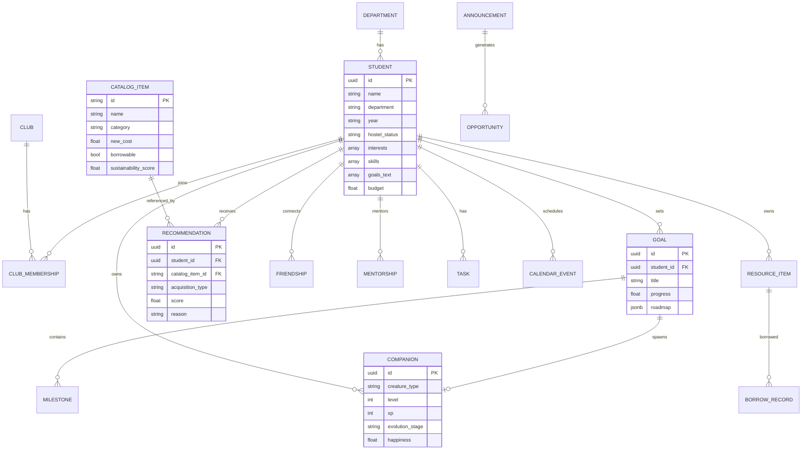

# Entity-Relationship Diagram

## Key Relationships

- Every **Goal** spawns a **Companion** creature (DSA Dragon, Fitness Dragon, etc.)
- **Recommendations** link students to **Catalog Items** with acquisition type
- **Campus Graph** connects students via friendships and mentorships
- **Intelligence Hub** feeds opportunities into the recommendation engine
